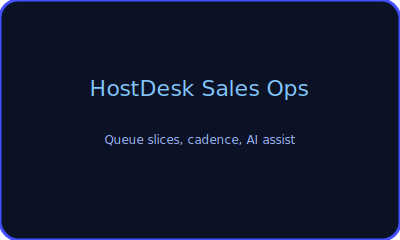
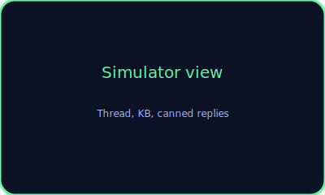

# HostDesk

Hosting-support triage simulator built in React/TypeScript with Vite, JSON seeds, and localStorage. It models SLA timing, tiered routing, KB suggestions, canned replies, private notes, and balanced scoring so a recruiter can immediately appreciate ticket intake discipline.

## Live demo (GitHub Pages)
`https://josuejero.github.io/HostDesk/`

## Screenshots
| Overview | Ticket view |
| --- | --- |
|  |  |

## Feature list
- **Triage-first experience:** hero CTAs, scenario catalog, SLA-aware header, and escalation path make intent immediately obvious.
- **Threaded communication:** public replies and private notes are separated; canned replies can be edited before sending.
- **KB + canned replies:** keyword-driven article suggestions, share buttons, and editable templates keep replies human while staying fast.
- **Scorecard + closure discipline:** Balanced SLA + empathy rubric tracked alongside scorecard metrics, plus a de-escalation scorecard that rates empathy, clarity, ownership, routing, escalation, expectation setting, and closure quality with rule-based guidance; a postmortem form captures root cause, fix, follow-up, and prevention.
- **Demo controls:** three “Jump into a case” starters (Billing Suspension, Minecraft crash, Discord bot outage), recruiter walkthrough overlay, scenario library, and reset demo button.

## Architecture overview
- `data/scenario-catalog.json`, `data/kb-articles.json`, `data/canned-replies.json`, and `data/scoring-rubric.json` provide the synthetic catalog, KB, canned replies, and rubric.
- `useLocalStorageState` seeds React state from the catalog, tracks mutations, and persists every agent action under `hostdesk-demo-state`.
- React components surface the SLA timer, metadata, scorecard, KB suggestions, canned replies, and postmortem form; updates call `applyScoreDelta` to keep the scoring rubric aligned with actions.
- Vite/TypeScript handles bundling, and GitHub Actions builds + deploys `dist/` to `gh-pages` (free via GitHub Pages).

## Scenario catalog
All 17 synthetic cases live in `data/scenario-catalog.json`. They span **Technical**, **Billing/Account**, and **Communication/Judgment** buckets, covering plugin crashes, bot outages, billing holds, domain renewals, and empathy-paced escalations. See `docs/scenario-catalog.mdx` for a narrative breakdown.

## Scoring rubric
Balanced SLA + empathy focus (`data/scoring-rubric.json`) scores six metrics: SLA compliance, communication, technical ownership, KB/self-service, escalation judgment, and closure completeness. Each metric includes weights, max values, and suggestions that show how to move the needle with every reply.

## What this proves
This repo demonstrates not just React UI, but operational awareness: threaded tickets, SLA countdowns, tiered escalation, KB/canned assistance, private notes, post-incident closure, and recruiter-worthy scoring. It proves you can design a static app that feels like a real support shift simulator with zero backend dependencies.

## Optional extras
- Reset button lets recruiters replay scenarios anytime.
- Recruiter walkthrough overlay explains what to notice in each case.
- Optional 60–90 second screen recording available on request (add the link in the README when you record it).

## Getting started
```bash
npm install
npm run dev
```

Deploy the Vite build via `npm run build` and `npm run deploy` (GitHub Actions automatically runs on `main` pushes and publishes to `gh-pages`).
