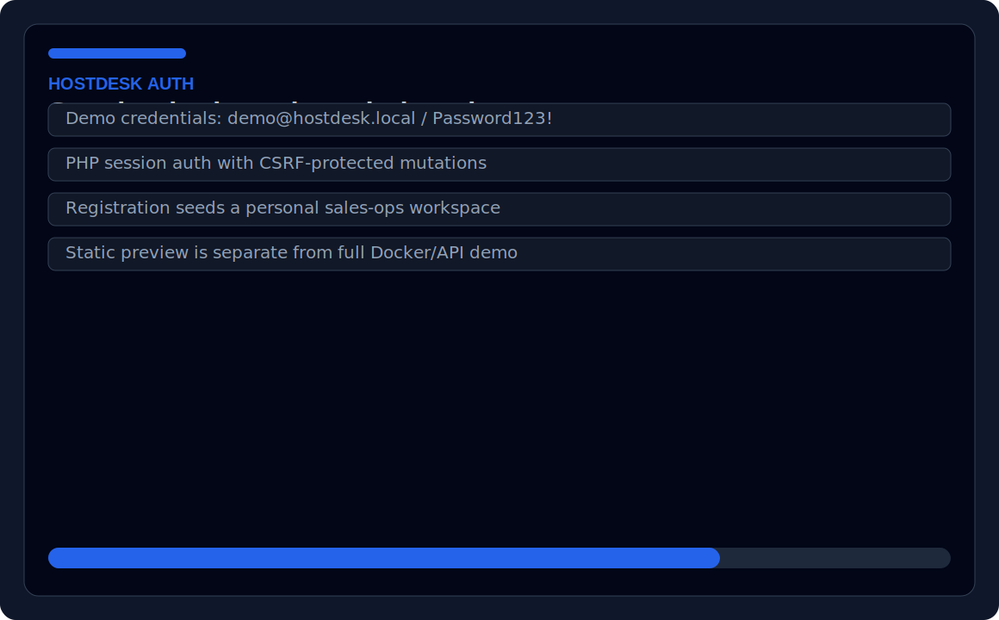
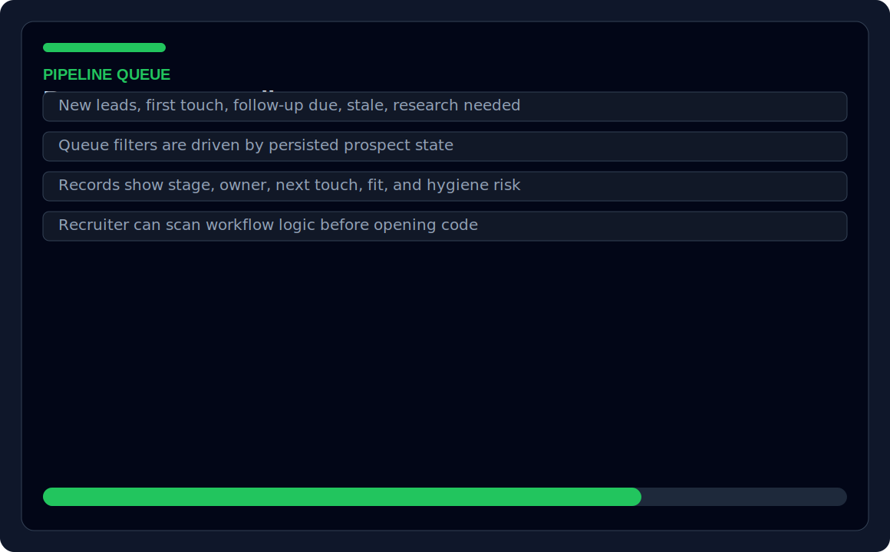
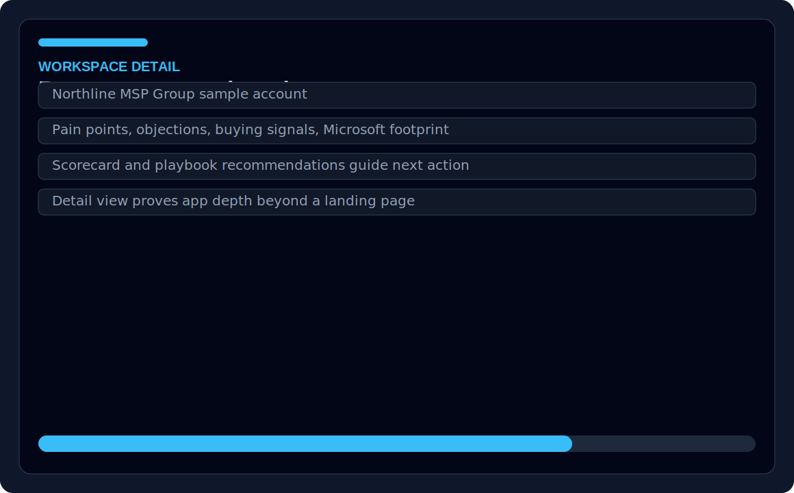
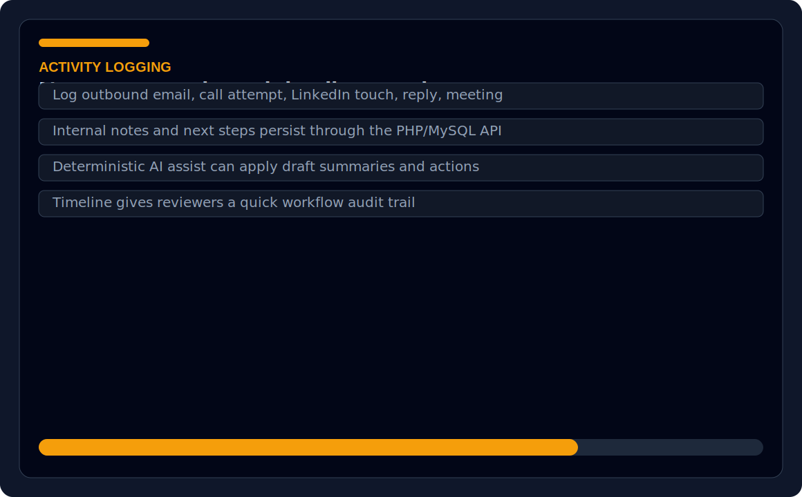
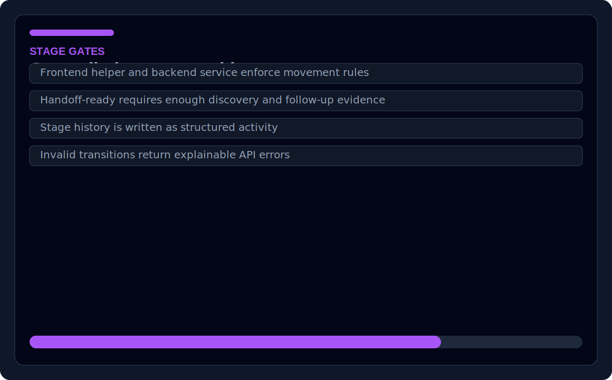
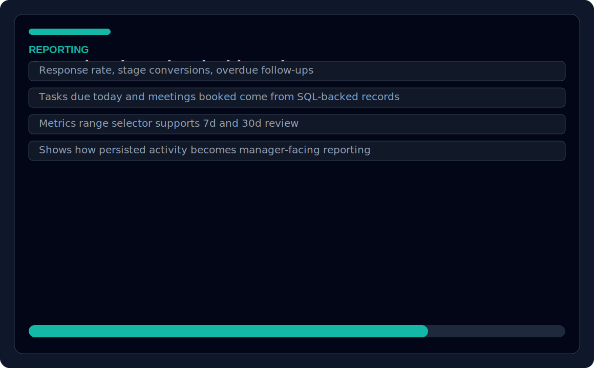
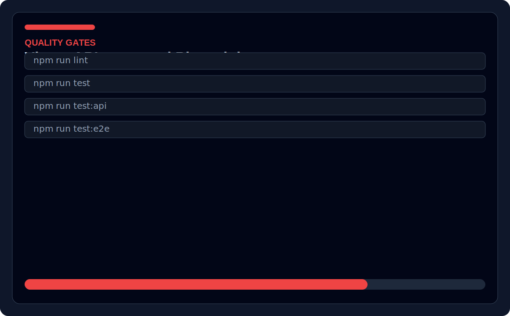

# HostDesk

[](https://github.com/josuejero/HostDesk/actions/workflows/ci.yml)
[](https://github.com/josuejero/HostDesk/actions/workflows/deploy.yml)
[](https://github.com/josuejero/HostDesk/actions/workflows/lighthouse.yml)
[](https://github.com/josuejero/HostDesk/actions/workflows/codeql.yml)
[](https://github.com/josuejero/HostDesk/actions/workflows/scorecard.yml)
[](https://scorecard.dev/viewer/?uri=github.com/josuejero/HostDesk)

HostDesk is a full-stack workflow simulator with a React/TypeScript frontend, PHP JSON API, MySQL persistence, Docker Compose runtime, seeded demo data, authenticated sessions, CSRF-protected mutations, SQL-backed workflow metrics, and automated validation through Vitest, API integration tests, Playwright E2E tests, and GitHub Actions.

The app models a saved pipeline instead of a browser-only demo. Users register or sign in, receive their own seeded workspace, and then work through queue slices, stage gates, notes, activity logging, guided research, canned outreach, deterministic AI assist, and metrics that are computed from persisted activity.

## Project evidence

| Area | Evidence |
|---|---|
| Full-stack scope | React/TypeScript frontend, PHP JSON API, MySQL persistence, Docker Compose runtime |
| API surface | 17 REST-style route entries across auth, prospects, cadence tasks, stage transitions, metrics, and demo reset |
| Data model | 7 MySQL tables with 7 foreign keys and 10 indexes |
| Demo dataset | 9 seeded prospect scenarios, 8 KB articles, 7 canned reply templates |
| Testing | Vitest frontend tests, Docker-backed PHP/MySQL API integration tests, Playwright E2E flows |
| CI | GitHub Actions runs install, seed-data validation, Docker startup, API health check, PHP syntax check, lint, build, tests, coverage, and E2E tests |
| Security controls | Password hashing, login-attempt lockout, session ID regeneration, CSRF token validation, authenticated API mutations |

## Quick links
- **Live demo:** [GitHub Pages static frontend preview](https://josuejero.github.io/HostDesk/) for the built UI shell; use local Docker for the full API-backed demo
- **Screenshots:** [login](public/images/screenshots/login.svg), [queue](public/images/screenshots/prospect-queue.svg), [detail](public/images/screenshots/prospect-detail.svg), [activity flow](public/images/screenshots/notes-activity-flow.svg), [stage transition](public/images/screenshots/stage-transition.svg), [metrics](public/images/screenshots/metrics.svg), [test output](public/images/screenshots/test-output.svg)
- **Test report:** `npm run test`, `npm run test:coverage`, `npm run test:api`, and `npm run test:e2e`
- **CI and deployment workflows:** `.github/workflows/ci.yml`, `.github/workflows/deploy.yml`, `.github/workflows/lighthouse.yml`, `.github/workflows/codeql.yml`
- **Architecture docs:** `docs/architecture.md`, `docs/api-reference.md`, `docs/development.md`, `docs/project-metrics.md`
- **Main code to inspect:** `src/`, `api/`, `tests/`, `data/scenario-catalog.json`

## Security

Security reporting expectations are documented in [SECURITY.md](SECURITY.md). Please do not open public issues for suspected vulnerabilities.

## License

This project is licensed under the MIT License. See [LICENSE](LICENSE).

## Engineering evidence

HostDesk includes 17 API route entries, a 7-table MySQL schema with 7 foreign keys and 10 indexes, 9 seeded workflow scenarios, session authentication, CSRF-protected mutations, SQL-backed workflow metrics, and CI validation across linting, TypeScript build, frontend tests, API integration tests, coverage, seed-data schemas, PHP syntax, and Playwright E2E tests.

Latest measured baseline:

- Frontend coverage: 70.94% statements, 61.76% branches, 71.29% functions, 71.36% lines
- Static frontend Lighthouse: 100 Performance, 100 Accessibility, 96 Best Practices, 1.66s LCP, 0 CLS, 0ms TBT
- Security baseline: password hashing, session ID regeneration, CSRF validation, login-attempt lockout, runtime dependency audit with 0 high/critical vulnerabilities, full dependency audit with 0 high/critical vulnerabilities, Dependabot, CodeQL for JS/TS and Actions, OpenSSF Scorecard

The GitHub Pages demo is deployed as a static frontend preview. The full API-backed app runs locally with Docker Compose.

Supporting evidence lives in `docs/project-metrics.md`, `metrics/latest.json`, `docs/test-matrix.md`, `docs/security-checklist.md`, and the GitHub Actions artifacts for coverage, Playwright, and Lighthouse.

## Employer scan
**Best fit roles:** Junior Full-Stack Developer, Software Developer, Application Developer  
**Core stack:** React, TypeScript, PHP, MySQL, Docker Compose, Vitest, Playwright  
**What this proves:** Authenticated workflows, REST-style APIs, SQL persistence, CSRF protection, test automation, Docker-based local setup  
**Start here:** `src/`, `api/`, `tests/`, `docs/api-reference.md`

## Demo options
- **Fast scan:** open the screenshots below to review login, queue routing, prospect details, notes/activity logging, stage movement, metrics, and test coverage without running the app.
- **Full local demo:** run `npm install`, `npm run docker:up`, and `npm run dev`; click **Need an account?** and use the default local demo fields (`demo@hostdesk.local` / `Password123!`) to create a seeded account.
- **Seed/reset flow:** registration creates a personal copy of `data/scenario-catalog.json`; `POST /api/demo/reset` reseeds the current user's workspace.
- **Deployment note:** static hosting alone is not the full app because browser requests expect a same-origin `/api`, session cookies, and CSRF headers.

## Screenshot gallery
| Login | Prospect queue |
| --- | --- |
|  |  |

| Prospect detail | Notes and activity flow |
| --- | --- |
|  |  |

| Stage transition | Metrics and test output |
| --- | --- |
|  |  |



## Documentation Map

- [Architecture and runtime](docs/architecture.md)
- [API reference](docs/api-reference.md)
- [Development workflow](docs/development.md)
- [Scenario catalog](docs/scenario-catalog.mdx)

## What The Project Covers

- Authenticated workspace with PHP sessions and CSRF-protected mutations
- Per-user seeded demo data copied from `data/scenario-catalog.json`
- Queue slices for new leads, first touch, follow-up due, stale, research needed, meeting booked, handoff ready, and nurture or disqualified work
- Guided research and playbook suggestions driven by scenario metadata and keywords
- Deterministic AI assist that can apply summaries, next-best actions, and draft replies without calling an external LLM
- SQL-backed metrics for response rate, stage conversions, overdue follow-ups, tasks due today, and meetings booked
- Stage-gated pipeline motion enforced in both frontend helpers and backend services

## Stack Snapshot

- Frontend: React 19, TypeScript, Vite, ESLint, Vitest, Playwright
- Backend: PHP 8.3 CLI server, PDO, MySQL 8, session auth, CSRF tokens
- Test layers:
  - `npm run test` for frontend units and component-level integration with the mock API
  - `npm run test:api` for real PHP/MySQL integration tests
  - `npm run test:e2e` for Playwright end-to-end coverage
- Local orchestration: Docker Compose for MySQL and the PHP API

## Repo Layout

```text
HostDesk/
|- api/                   PHP API, routes, services, repositories, schema
|- data/                  Scenario catalog, playbooks, canned replies, scoring rubric, JSON schemas
|- docs/                  Project documentation
|- public/                Static assets
|- src/                   React app, hooks, components, styles, API client
|- tests/                 API and Playwright tests
|- .github/workflows/     CI and build workflows
|- docker-compose.yml     Local MySQL + PHP API stack
```

## Seeded Content

The repository ships with:

- 9 seeded scenarios
- 8 playbook articles
- 7 canned outreach templates
- 1 scoring rubric used by the sidebar scorecard

The source of truth for seeded records is [`data/scenario-catalog.json`](data/scenario-catalog.json). On registration and on `POST /api/demo/reset`, those scenarios are copied into MySQL for the current user. The original scenario `record.id` is stored in the database as `external_key`.

## Quick Start

### Prerequisites

- Node.js 20 or newer
- npm
- Docker Desktop or another Docker engine that supports Compose
- Open ports `3306`, `5173`, and `8080`

### Local Setup

1. Install frontend dependencies:

   ```bash
   npm install
   ```

2. Copy `.env.example` to `.env` if you need to override defaults.

3. Start MySQL and the PHP API:

   ```bash
   npm run docker:up
   ```

4. Start the frontend in a second terminal:

   ```bash
   npm run dev
   ```

### Local URLs

- Frontend: `http://127.0.0.1:5173`
- API: `http://127.0.0.1:8080`
- Health check: `http://127.0.0.1:8080/api/health`

In development, Vite proxies `/api` requests to the PHP server. In deployed environments, the frontend expects the API to be reachable at the same origin under `/api`.

## Environment Variables

These values are loaded from `.env` by the PHP bootstrap and partly reused by Vite and tests:

| Variable | Used by | Purpose |
| --- | --- | --- |
| `APP_ENV` | API | Environment label |
| `APP_DEBUG` | API | Enables PHP error display when set to `1` |
| `APP_TIMEZONE` | API | Default timezone for backend date handling |
| `DB_HOST` | API | MySQL host |
| `DB_PORT` | API | MySQL port |
| `DB_NAME` | API | Database name |
| `DB_USER` | API | Database username |
| `DB_PASSWORD` | API | Database password |
| `SESSION_NAME` | API | PHP session cookie name |
| `SESSION_COOKIE_SECURE` | API | Secure cookie toggle |
| `SESSION_COOKIE_SAMESITE` | API | SameSite policy for the session cookie |
| `VITE_BASE_PATH` | Frontend build | Base path for the generated bundle |
| `VITE_API_PROXY_TARGET` | Vite dev server | Proxy target for `/api` during local development |
| `HOSTDESK_API_BASE_URL` | Node-side tests | Base URL for `npm run test:api` |

## Quality Gates

```bash
npm run lint
npm run php:lint
npm run data:validate
npm run test
npm run test:api
npm run test:e2e
```

If Playwright browsers are missing locally:

```bash
npx playwright install
```

Useful Docker helpers:

```bash
npm run docker:logs
npm run docker:down
```

## API Snapshot

Auth and session:

- `GET /api/health`
- `POST /api/auth/register`
- `POST /api/auth/login`
- `POST /api/auth/logout`
- `GET /api/auth/session`

Prospects and mutations:

- `GET /api/prospects`
- `GET /api/prospects/:id`
- `POST /api/prospects/:id/notes`
- `POST /api/prospects/:id/activities`
- `POST /api/prospects/:id/cadence-tasks`
- `PATCH /api/cadence-tasks/:id`
- `POST /api/prospects/:id/stage-transitions`
- `PATCH /api/prospects/:id/review`
- `PATCH /api/prospects/:id/ownership`
- `PATCH /api/prospects/:id/ai-fields`
- `GET /api/metrics?range=7d|30d`
- `POST /api/demo/reset`

Every API response uses the same envelope:

- Success: `{ "ok": true, "data": ... }`
- Failure: `{ "ok": false, "error": { "code": "...", "message": "...", "fieldErrors": {} } }`

See [docs/api-reference.md](docs/api-reference.md) for payloads, stage-gate rules, CSRF behavior, and error codes.

## CI And Deployment Automation

- `.github/workflows/ci.yml` runs lint, frontend tests, real API tests, and Playwright against the Docker Compose stack.
- `.github/workflows/deploy.yml` builds the Vite static preview with `VITE_BASE_PATH=/HostDesk/`, uploads `dist/` as a Pages artifact, and deploys it to GitHub Pages.

The Pages deployment is intentionally a static UI preview. The generated frontend bundle still needs an API host mounted at `/api` for full authenticated PHP/MySQL behavior outside local development.
